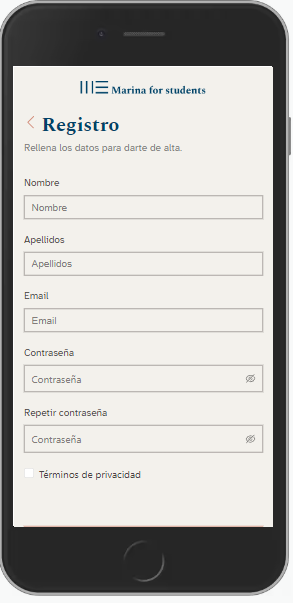
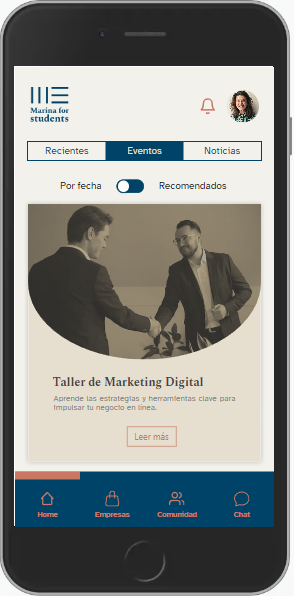
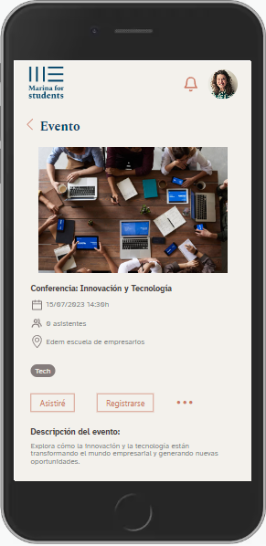
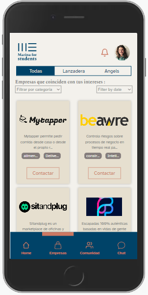
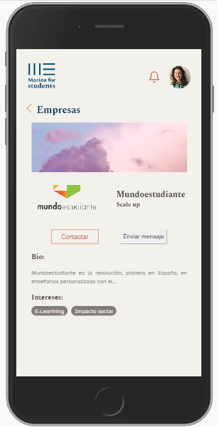
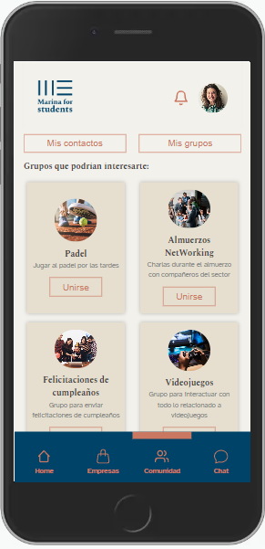
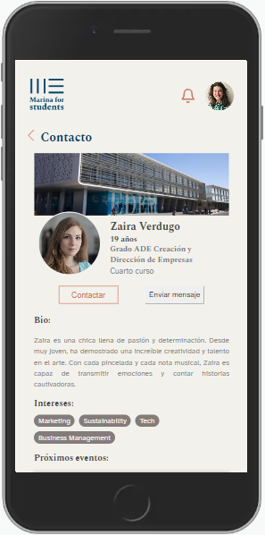
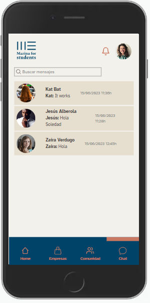
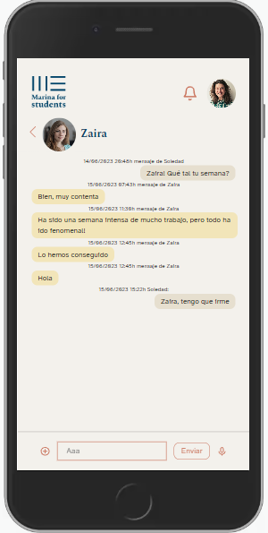
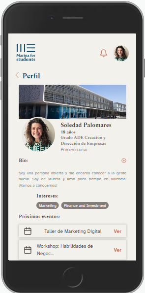

# Marina for Students - frontend

 

 The objective of this course project was to create a mobile-first user interface for an app for the students of Edem Escuela de Empresarios to keep up to date with everything happening in Marina de Empresas and communicate with each other, the school and startups at the Lanzadera accelerator.

  This full stack project was created during a **two-week sprint** together with a team from **data science**, 
**cybersecurity** and **UX/UI**.

### This reporitory contains the frontend for the project. The backend can be found at

[Marina for Students backend ](https://github.com/kbastamow/Tripulaciones-backend)

## 🖥️Tech

The front was created as a Single Page Application with **React** and deployed online with **AWS**.

## 📜Dependencies

-  Redux
-  React-router
-  Axios
-  Dotenv
-  Socket.io-client
-  React-google-recaptcha

Styles

- Sass
- Antd
- React-icons

The design was created based on a Figma design provided by the UX/UI team.

Photos are stockphotos from www.pexels.com.

## Login and register

 
 

Register is limited to emails associated with the business school and password must adhere to certain security length and type of characters.

Login includes a captcha to protect the app against bots. In logging in, a token is saved in the browser's local storage so the user can close the app without being logged out.

In case of trying to access pages without being logged in, the user is automatically redirected back to login screen. A personalised 404 page is shown for routes not active.

## Home

 
 

The home page shows future events such as talks and workshops taking place at the business school, ordered by date. A switch button can be used to show events recommended for the user, based on an algorithm designed by data science and connected to the backend.

By clicking the read more button the user can see each event in more detail, and sign up for the event. The date and number of attendees are created dynamically.

## Startups

 
 

Through navbar the user can see a list of companies currently active at the Lanzadera startup accelerator, and search them by category.

Each startup has a profile page which would be styled by the startup itself through access to the platform, in the future.

## Community

 
 

Here the user sees a list of people and recommended student-created groups for the user, though the algorithm isn't currently in place.

The user can view the profiles and groups profiles(to be implemented) in more detail and contact the people.

## Chat

 
 

Chat shows the user's history of chats. By entering a one-to-one chatroom, a connection to the server is opened through websocket technology, which allows for an instant chat feature. Each chat is identified by a unique id to keep the conversation private.

## User profile

The top header has two clickable buttons, the logo which takes the user to the events homepage, and profile picture which opens the user profile. Here the user can see their upcoming events and modify their details (forms to be implemented), and also log out.

## ✌🏽 Team Full Stack 

- [Kbastamow](https://github.com/kbastamow)
- [Jllanas1986](https://github.com/jllanas1986)
- [Amsiceza](https://github.com/amsiceza)
- [VolodymyrKolomiets](https://github.com/VolodymyrKolomiets)

