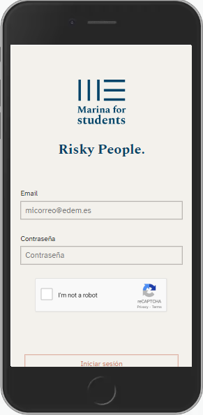

# Marina for Students - frontend

 

 The objective of this course project was to create a mobile-first user interface for an app for the students of Edem Escuela de Empresarios to keep up to date with everything happening in Marina de Empresas and communicate with each other, the school and startups at the Lanzadera accelerator.

  This project was created as a two-week sprint together with a team from **data science**, 
**cybersecurity** and **UX/UI**.

### This reporitory contains the frontend for the project. The backend can be found at

[Marina for Students backend ](https://github.com/kbastamow/Tripulaciones-backend)

## 🖥️Tech

The front was created with **React** and deployed online with **AWS**.

## 📜Dependencies

-  Redux
-  React-router
-  Axios
-  Dotenv
-  Socket.io-client
-  React-google-recaptcha

Styles

- Sass
- Antd
- React-icons

The design was created based on a Figma design provided by the UX/UI team.

Photos are stockphotos from www.pexels.com.

## Login and register

 
 

Register is limited to emails associated with the business school and password must adhere to certain security length and type of characters.

Login includes a captcha to protect the app against bots.

## Home

 
 

